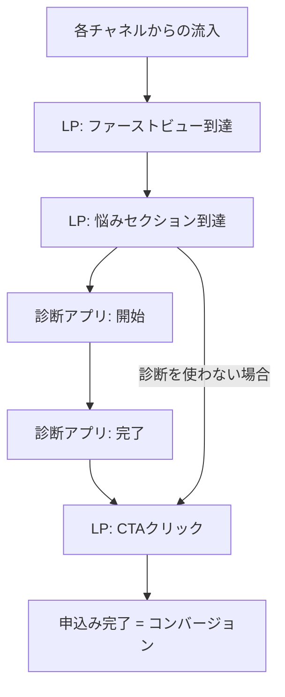

# LP・診断アプリ アクセス分析 設計書

対象:着色料無添加サプリ定期便 LP + パーソナル診断アプリの集客導線

> **更新履歴**:初回運用時にKPIの目標数値をどう考えるか(ベースライン取得の方針)を「5. 初回運用時のKPI設定方針」として追記した。

---

## 1. 分析ゴール

これまでの顧客データ分析(`analysis/customer_analysis.ipynb`)は「**どんな人が優良顧客になりやすいか**」を明らかにするものだった。今回はその手前の段階、すなわち「**集客〜LP〜診断アプリ〜申込みという導線のどこが機能し、どこで離脱しているか**」を明らかにすることをゴールとする。

最終的な着地点:「**どのチャネルに予算を寄せるべきか」「診断アプリはCVR改善に貢献しているか」「LPのどの導線を改善すべきか**」を、データに基づいて言えるようにする。

## 2. 分析対象とする導線(ファネル)

診断アプリを使わずに直接LPのCTAへ進む経路も存在するため、両方のパターンを1つのセッションデータの中で表現する。

## 3. 分析項目(何を明らかにするか)

| No | 分析項目 | 目的 |
|---|---|---|
| A-1 | チャネル別の流入数・CVR・CPA比較 | どのチャネルに広告予算を寄せるべきかを判断する |
| A-2 | ファネル各ステップの通過率・離脱率 | LP・診断アプリのどの段階で最も離脱が起きているかを特定する |
| A-3 | 診断アプリ利用有無によるCVRの比較 | 診断アプリが本当にCVR改善に貢献しているかを検証する |
| A-4 | 診断結果タイプ別のCTAクリック率・CVR比較 | どのタイプの診断結果が最も申込みに繋がりやすいかを見る |
| A-5 | チャネル×診断利用有無のクロス分析 | 特定のチャネルで診断アプリが特に効いている、という組み合わせを探す |

## 4. KPI定義

| 指標 | 定義 |
|---|---|
| CVR(コンバージョン率) | 申込み完了数 ÷ LP訪問数 |
| CPA(顧客獲得単価) | チャネル別広告費 ÷ そのチャネルの申込み完了数 |
| 診断完了率 | 診断開始数のうち、完了まで至った割合 |
| 診断経由CVR | 診断を完了したセッションのうち、申込みに至った割合 |
| 非診断CVR | 診断を使わなかったセッションのうち、申込みに至った割合 |

---

## 5. 初回運用時のKPI設定方針

「何を測るか(4章のKPI定義)」と「いくつを目指すか(目標数値)」は分けて考える。前者は運用開始前に必ず決めるが、**後者(目標数値)は初回運用の前には確定させない**。

### なぜ初回から目標数値を置かないか

初めて実施する施策には、比較対象となる過去の実績が存在しない。この状態で「CVR3%を目指す」のような数値を置いても、根拠のない当てずっぽうになり、達成できても未達でも、その数値自体から学べることが少ない。

### 方針

1. **最初の期間はベースライン(実測値)の取得を目的にする**
   初回運用の期間(目安:最低2〜4週間、またはセッション数が合計1,000件に達するまで)は、成果目標を置かず、チャネル別のCVR・CPA・診断完了率などの実測値を取得することを優先する。

2. **目標を置く場合は、1点の数値ではなく「仮の範囲」にする**
   どうしても初回から目安が必要な場合は、業界の一般的な傾向などを参考にした**幅のある仮説**として置き、「実績が出た時点で見直す前提の数値である」ことを明記する。

3. **2回目以降は、絶対値ではなく「変化率」で評価する**
   初回で得たベースラインを基準に、「前回実績と比べて何%改善したか」という相対評価に切り替える。絶対値の目標がなくても、このサイクルで継続的な改善は回せる。

4. **セッション数が少ないチャネル・区分の数値は、参考値として扱う**
   分母となるセッション数が少ない場合、CVRなどの数値は数件の増減で大きくぶれる。チャネル別・診断結果タイプ別に評価する際は、一定件数(例:各区分50セッション以上)に達するまでは、数値の変化を過大評価しないよう注意する。

### 今回のポートフォリオでの扱い

本プロジェクトでは架空データのため、上記の考え方はあくまで運用ルールとして設計書に明記するに留める。`funnel_analysis.ipynb`で示した数値(CVR、CPAなど)は、実務であれば「初回運用で得られたベースライン」に相当するものとして位置づけている。

---

## 6. 使用データ

| データ名 | 内容 | 粒度 |
|---|---|---|
| `session_data.csv` | 1セッション(1訪問)ごとの行動ログ(流入チャネル、各ステップの到達有無、診断結果タイプ、CV有無) | セッション単位 |
| `channel_ad_cost.csv` | チャネル別の月間広告費用(CPA算出用) | チャネル単位 |

セッションデータの主な列:

| 列名 | 内容 |
|---|---|
| session_id | セッションを一意に識別するID |
| channel | 流入チャネル(SNS広告/検索広告/自然検索/紹介) |
| visit_date | 訪問日 |
| reached_pain_section | 悩みセクションまでスクロールしたか(1/0) |
| diagnostic_started | 診断アプリを開始したか(1/0) |
| diagnostic_completed | 診断を最後まで完了したか(1/0) |
| diagnostic_result_type | 診断結果タイプ(rest/reset/overwork、未実施はNone) |
| cta_click | LPのCTAボタンをクリックしたか(1/0) |
| conversion | 申込みフォームを完了したか(1/0) |

## 7. ツール選定のアドバイス

**結論:今回もPythonをおすすめします。** 理由は前回(顧客データ分析)と同じ3点に加え、今回はもう1つ理由が増えます。

1. **GitHubとの一貫性**:これまでの分析(`customer_analysis.ipynb`)と同じ形式でファネル分析を積み上げられる
2. **再現性**:意図した離脱率・チャネル差をコードで明示的に埋め込める
3. **BIツールとの連携**:PythonでCSVを整えておけば、そのままPower BIやExcelにも読み込める。**「Pythonで分析→Power BIでダッシュボード化」という両方のスキルを見せられる**構成にできる

一方で、**Excelにも向いている点**があります。

- ファネルの各段階を「積み上げ横棒グラフ」で見せるような、直感的な資料化はExcelの方が早いことがある
- チームメンバーや非エンジニアに共有する前提なら、Excelの方が受け取り手の敷居が低い

**今回の進め方の提案**:データの生成と基礎集計はPythonで行い(再現性を優先)、そのCSVを使って**Power BIダッシュボードも別途作る**(以前の求人要件にあった「BIツール運用ができる人」のアピールにも繋がる)、という**両取りの構成**にするのがおすすめです。
