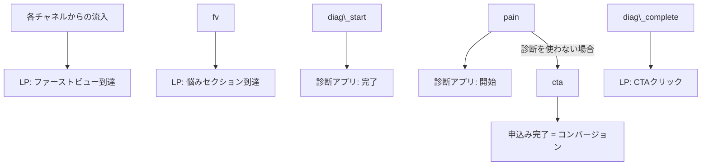

# LP・診断アプリ アクセス分析 設計書

対象:着色料無添加サプリ定期便 LP + パーソナル診断アプリの集客導線

\---

## 1\. 分析ゴール

これまでの顧客データ分析(`analysis/customer\_analysis.ipynb`)は「**どんな人が優良顧客になりやすいか**」を明らかにするものだった。今回はその手前の段階、すなわち「**集客〜LP〜診断アプリ〜申込みという導線のどこが機能し、どこで離脱しているか**」を明らかにすることをゴールとする。

最終的な着地点:「**どのチャネルに予算を寄せるべきか」「診断アプリはCVR改善に貢献しているか」「LPのどの導線を改善すべきか**」を、データに基づいて言えるようにする。

## 2\. 分析対象とする導線(ファネル)

診断アプリを使わずに直接LPのCTAへ進む経路も存在するため、両方のパターンを1つのセッションデータの中で表現する。

## 3\. 分析項目(何を明らかにするか)

|No|分析項目|目的|
|-|-|-|
|A-1|チャネル別の流入数・CVR・CPA比較|どのチャネルに広告予算を寄せるべきかを判断する|
|A-2|ファネル各ステップの通過率・離脱率|LP・診断アプリのどの段階で最も離脱が起きているかを特定する|
|A-3|診断アプリ利用有無によるCVRの比較|診断アプリが本当にCVR改善に貢献しているかを検証する|
|A-4|診断結果タイプ別のCTAクリック率・CVR比較|どのタイプの診断結果が最も申込みに繋がりやすいかを見る|
|A-5|チャネル×診断利用有無のクロス分析|特定のチャネルで診断アプリが特に効いている、という組み合わせを探す|

## 4\. KPI定義

|指標|定義|
|-|-|
|CVR(コンバージョン率)|申込み完了数 ÷ LP訪問数|
|CPA(顧客獲得単価)|チャネル別広告費 ÷ そのチャネルの申込み完了数|
|診断完了率|診断開始数のうち、完了まで至った割合|
|診断経由CVR|診断を完了したセッションのうち、申込みに至った割合|
|非診断CVR|診断を使わなかったセッションのうち、申込みに至った割合|

## 5\. 使用データ

|データ名|内容|粒度|
|-|-|-|
|`session\_data.csv`|1セッション(1訪問)ごとの行動ログ(流入チャネル、各ステップの到達有無、診断結果タイプ、CV有無)|セッション単位|
|`channel\_ad\_cost.csv`|チャネル別の月間広告費用(CPA算出用)|チャネル単位|

セッションデータの主な列:

|列名|内容|
|-|-|
|session\_id|セッションを一意に識別するID|
|channel|流入チャネル(SNS広告/検索広告/自然検索/紹介)|
|visit\_date|訪問日|
|reached\_pain\_section|悩みセクションまでスクロールしたか(1/0)|
|diagnostic\_started|診断アプリを開始したか(1/0)|
|diagnostic\_completed|診断を最後まで完了したか(1/0)|
|diagnostic\_result\_type|診断結果タイプ(rest/reset/overwork、未実施はNone)|
|cta\_click|LPのCTAボタンをクリックしたか(1/0)|
|conversion|申込みフォームを完了したか(1/0)|

