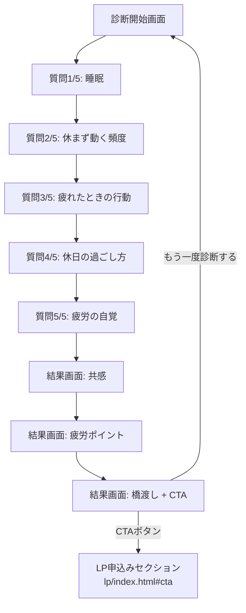

# パーソナル診断ツール 企画書・要件定義書(v2)

対象プロダクト:着色料無添加サプリ定期便「澄み疲労ケア」パーソナル診断

> **v2での変更点**:v1(顧客セグメント起点の診断)から、v2ではユーザー起点(疲労の原因を自覚してもらう診断)へ設計思想を転換した。変更の経緯は「0. 設計変更の経緯」を参照。

---

## 0. 設計変更の経緯(v1 → v2)

v1は、顧客データ分析(STEP1〜5)で見つけた「優良顧客になりやすい3タイプ(疲労ケア重視/成分安心重視/継続重視)」を、そのまま診断結果のタイプとして転用していた。しかし実装後にレビューした結果、以下の問題が見つかった。

| 観点 | v1の問題点 | v2での対応 |
|---|---|---|
| 診断の主語 | 「あなたはどの顧客セグメントか」を聞いており、事業者側の分類をユーザーに答えさせる形になっていた | 「あなたの疲れはどこから来ているか」というユーザー自身の課題を診断する形に転換した |
| ユーザーへの価値提供 | 診断してもタイプの説明を受け取るだけで、気づきや発見が乏しかった | 本人が無意識にやっている行動を具体的に問う設問にし、「そういえば」という気づきを生む設計にした |
| 商品数との整合性 | 3タイプ→3方向の訴求、という分岐型の発想だったが、商品は1種類しかなく分岐させる意味がなかった | どのタイプであっても最終的に「コンディションを整える」という同じ着地点に収束する設計にした |
| 結果画面の構成 | タイプ名+説明文+特徴3点、という説明的な構成だった | 「共感→気づき→橋渡し」という、心理的に納得感を生む3段構成に変更した |
| UI(付随課題) | 診断への導線がテキストリンクのみで、メインCTAとの視覚的な優先順位が逆転していた | 本要件定義とは別に、実装時にボタン化するなど視認性を改善する(詳細は「2-8. 既知の課題」参照) |

---

## 1. 企画書

### 1-1. 背景

LPの主訴求は「慢性的な疲労感」だが、疲労の原因は人によって異なる(睡眠不足、疲労が抜けない、頑張りすぎているなど)。この「原因の違い」をユーザー自身に気づかせることができれば、LPの提示する「コンディションケア」という解決策への納得感を、事前に高められると考えた。

### 1-2. 目的

- ユーザーに **「自分の疲れの原因」を自覚してもらう** ことを診断の主目的とする(商品訴求は診断の主目的にしない)
- 気づきを得たユーザーを、自然な流れでLPの提案(コンディションケアの習慣化)に接続する
- 診断コンテンツ自体を、SNSでシェアしたくなる・友人に勧めたくなるような「独立した読み物」としても成立させる

### 1-3. ターゲット

「最近なんとなく疲れている」と感じているが、その原因を言語化できていない人。年代・属性を限定しすぎず、LPのペルソナ(30代・仕事と育児を両立)を中心としながらも、より広い層が自分ごと化できる設問にする。

### 1-4. 提供価値(ユーザー視点)

| 誰に | 何を | なぜ嬉しいか |
|---|---|---|
| 疲れの原因を言語化できていない人 | 5つの行動ベースの質問による自己診断 | 「そういえば自分はこうかも」という気づきが得られる |
| 診断だけ受けて離脱したい人も含む | 商品訴求を前面に出さない診断体験 | アンケートのように「売り込まれている」感じがしない |

### 1-5. 差別化・工夫点

- **質問の設計思想**:「忙しいですか?」のような曖昧な質問ではなく、「気づくと長時間休まず動いていることがありますか?」のように、本人が無意識にやっている具体的な行動を問うことで、無難な回答への逃げを防ぐ
- **診断の順序設計**:直接「疲れていますか?」と聞くのではなく、生活習慣を4問振り返らせたあとに、5問目で初めて「以前と比べて疲れが残るか」を聞く。振り返りの後だからこそ、本人が自然に自覚できる流れにしている
- **商品数1つとの整合性**:3タイプに分岐しても、最終的な提案は「コンディションを整える」という1つの方向に収束させ、分岐が形骸化しないようにする
- **結果画面の構成**:「共感(こんな状態になっていませんか?)→気づき(あなたの疲労ポイント)→橋渡し(だからこそ〜)」という3段構成で、説明的にならず納得感を積み上げる

### 1-6. 成功指標(KPI、ポートフォリオ上の想定)

- 診断完了率(開始した人のうち、結果画面まで到達した割合)
- 結果画面からLPのCTAクリックに至った割合
- (発展指標)診断結果のシェア率、または「友人にすすめたいか」の任意アンケート反応

---

## 2. 要件定義書

### 2-1. 画面遷移

### 2-2. タイトル・サブタイトル

| 要素 | 内容 |
|---|---|
| タイトル | あなたの疲労はどこから?生活習慣5問チェック |
| サブタイトル | 「最近なんとなく疲れている…」その疲れ、毎日の生活習慣に原因が隠れているかもしれません。 |

### 2-3. 質問一覧

| No | 質問 | 狙い |
|---|---|---|
| Q1 | 最近、睡眠を十分にとれていると感じますか? | 睡眠不足・睡眠の質を、本人の自覚ベースで確認する |
| Q2 | 仕事や家事・育児などで、気づくと長時間休まず動いていることがありますか? | 「忙しいか」ではなく具体的な行動を問い、休息不足・頑張りすぎの傾向を拾う |
| Q3 | 疲れているとき、つい以下のようなことをしてしまいますか? | 疲労時の対処行動から、根本的な回復になっているかを見る |
| Q4 | 休日の過ごし方として、一番近いものは? | 平日の疲労が休日にどう蓄積・持ち越されているかを見る |
| Q5 | 最近、以前と比べて「疲れが残る」と感じることはありますか? | 4問の振り返りを経た上で、本人の疲労自覚を最後に確認する |

### 2-4. 選択肢とタイプ配点(データ設計)

3タイプ:`rest`(休息不足タイプ)/ `reset`(疲労リセット不足タイプ)/ `overwork`(頑張りすぎタイプ)

| 質問 | 選択肢 | 配点 |
|---|---|---|
| Q1 | A. 十分とれている | 加点なし |
| Q1 | B. やや足りない | rest +1 |
| Q1 | C. かなり足りない | rest +2 |
| Q1 | D. 時間は寝ているがスッキリしない | reset +2 |
| Q2 | A. ほとんどない | 加点なし |
| Q2 | B. たまにある | overwork +1 |
| Q2 | C. よくある | overwork +1 / rest +1 |
| Q2 | D. ほぼ毎日 | overwork +2 / rest +1 |
| Q3 | A. 特にない | 加点なし |
| Q3 | B. スマホ・SNSを見る時間が増える | reset +1 |
| Q3 | C. 甘いもの・食事で気分転換する | reset +1 |
| Q3 | D. 何もしたくなくなり、だらだら過ごす | rest +1 / reset +1 |
| Q4 | A. 平日とあまり変わらない | overwork +1 |
| Q4 | B. 趣味や外出を楽しむ | 加点なし |
| Q4 | C. 寝たり家でゆっくりしていることが多い | reset +1 |
| Q4 | D. やりたいことはあるが疲れて動けない | reset +2 |
| Q5 | A. ほとんど感じない | 加点なし |
| Q5 | B. 少し感じる | reset +1 |
| Q5 | C. かなり感じる | reset +2 |
| Q5 | D. 「昔はこれくらい平気だったのに」と思う | overwork +2 |

判定ロジック:5問終了後、3タイプのうち最もポイントが高いものを結果とする(同点の場合は `rest` → `reset` → `overwork` の順に優先する)。

> 補足:上記の配点は「各質問の狙い」から論理的に設計したものであり、実装時のチューニング対象として扱う。

### 2-5. 診断結果(3タイプ)

#### ①休息不足タイプ(`rest`)

- **原因**:休む時間が足りていない
- **特徴**:睡眠が不足しがち/忙しくて休憩を後回しにする/休日に寝て過ごすことが多い/疲れを感じても「まだ大丈夫」と頑張る
- **結果文**:「毎日の予定や仕事を優先するあまり、身体を休ませる時間が不足しているかもしれません。『疲れたら休む』ではなく、疲れを溜め込まないために、普段からコンディションを整えることを意識してみましょう。」

#### ②疲労リセット不足タイプ(`reset`)

- **原因**:疲れが翌日に持ち越されている
- **特徴**:寝ているのにスッキリしない/休日になっても疲れている/朝から疲労感がある/「寝れば回復するはずなのに」と感じる
- **結果文**:「しっかり休んでいるつもりでも、翌日まで疲れが残っていることが多いかもしれません。日々の疲れをそのまま翌日に持ち越さないためにも、睡眠や休息など、毎日のコンディションを見直してみましょう。」

#### ③頑張りすぎタイプ(`overwork`)

- **原因**:疲れていても無理をしてしまう
- **特徴**:「これくらい大丈夫」と思ってしまう/休むことに罪悪感がある/仕事・家事などを優先する/疲れていてもやるべきことを続ける
- **結果文**:「疲れていても『もう少し頑張ろう』と、自分の疲れを後回しにしていませんか?頑張ることも大切ですが、毎日のコンディションを整えることも、長く頑張るためには大切です。『まだ大丈夫』と思っている今こそ、自分の身体をいたわる習慣を始めてみましょう。」

### 2-6. 結果画面の構成要件(3段構成)

すべてのタイプで共通のテンプレート構造とし、中身のみタイプごとに差し替える。

| 構成要素 | 役割 | 内容の型 |
|---|---|---|
| ①共感パート | 「こんな状態になっていませんか?」で状況を言い当てる | タイプごとの特徴から2〜3個を、日常のセリフ調で提示 |
| ②気づきパート | 「あなたの疲労ポイント」として原因を言語化する | 結果文(2-5に記載)をそのまま使用 |
| ③橋渡しパート | 「だからこそ、コンディションケアを」で提案に接続する | 3タイプ共通の一文+LPへのCTAボタン |

橋渡しパートの共通文言(案):「忙しい毎日だからこそ、食事や睡眠だけでなく、日々のコンディションを整える習慣を意識してみましょう。」

### 2-7. 機能要件

| No | 機能 | 内容 |
|---|---|---|
| F-01 | 診断開始 | 「診断をはじめる」ボタンで質問1へ遷移する |
| F-02 | 質問表示 | 5問を1問ずつ表示し、各問4択(A〜D)の選択肢を提示する |
| F-03 | 進捗表示 | 現在の質問番号と進捗バーを表示する |
| F-04 | スコアリング | 2-4の配点表に基づき、選択肢ごとにタイプへポイントを加算する |
| F-05 | 前の質問に戻る | 2問目以降で表示し、直前の回答スコアを取り消して1問前に戻る |
| F-06 | 結果判定 | 最終スコアから3タイプのいずれかを判定する(同点時の優先順位は2-4参照) |
| F-07 | 結果表示(3段構成) | 2-6の構成要件に従い、共感→気づき→橋渡しの順で表示する |
| F-08 | 再診断 | スコアをリセットし、開始画面に戻る |
| F-09 | LPへの導線 | 橋渡しパートのCTAボタンから`../lp/index.html#cta`へ遷移する |

### 2-8. 既知の課題(次の実装ステップで対応)

| No | 課題 | 対応方針 |
|---|---|---|
| I-01 | LP側の診断導線がテキストリンクのみで、メインCTAより視覚的な優先順位が低く見える | ボタン化、またはアイコン・枠線を追加して視認性を上げる。本要件定義とは別のコード修正タスクとして対応する |

### 2-9. 非機能要件

v1から変更なし。

| No | 区分 | 内容 |
|---|---|---|
| N-01 | 対応環境 | スマートフォンを主対象としたレスポンシブ対応 |
| N-02 | 実行環境 | サーバーサイド処理なし、静的ファイル(HTML/CSS/JS)のみで完結 |
| N-03 | プライバシー | 回答内容はブラウザ内でのみ処理し、外部送信・保存は行わない |
| N-04 | パフォーマンス | 外部ライブラリを使用せず、Webフォント以外の外部通信を発生させない |
| N-05 | アクセシビリティ | ボタンはキーボード操作可能なフォーカス状態を持たせる |
| N-06 | 表現規制 | 効果効能を断定する表現は使用しない。結果画面下部に免責文を明記する |

### 2-10. 技術仕様

v1から変更なし(HTML/CSS/JS単一ファイル構成、LPと共通のデザイントークンを使用)。

### 2-11. 制約・非対応事項(スコープ外)

- 回答データの保存・集計機能
- 多言語対応
- SNSシェア機能(将来の拡張候補としては有効。「1-6 成功指標」に発展指標として記載)

---

## 3. 今後の拡張候補(メモ)

- 結果画面に「Xでシェアする」ボタンを追加し、診断結果自体の拡散を狙う
- 診断結果をURLパラメータで保持し、LP到達後に「あなたは○○タイプでしたね」という一言を表示する連携
