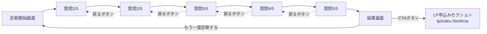

# パーソナル診断ツール 企画書・要件定義書

対象プロダクト:着色料無添加サプリ定期便「澄み疲労ケア」パーソナル診断

---

## 1. 企画書

### 1-1. 背景

顧客データ分析(`analysis/customer_analysis.ipynb`)の結果、LPへの流入者は「30代・SNS広告経由・慢性的な疲労感」を主訴としつつ、「成分・添加物への不安」も同時に抱えている層がボリュームゾーンであることが分かった。一方で、悩みの内訳は一様ではなく、疲労感が主訴の層・添加物への不安が主訴の層・継続のしやすさを重視する層に分かれている。

LP単体は「1つの訴求軸」に沿って一直線に構成されているため、悩みのタイプが異なる訪問者に対しては刺さり方にばらつきが出る可能性がある。この課題を補うため、**訪問者ごとに自分の悩みのタイプを自覚してもらい、その上でLPの訴求内容を自分ごととして読んでもらうための診断コンテンツ**を企画した。

### 1-2. 目的

- 訪問者に**自分の悩みのタイプを言語化・自覚してもらう**ことで、LP本編への関心・納得感を高める
- 診断結果からLPの申込みセクションへ誘導し、**回遊・CTA到達率を高める**導線を作る
- マーケティング施策上は、SNS広告のクリエイティブ出し分け(疲労感訴求/添加物訴求/コスパ訴求)と連動させ、**診断結果を広告の反応データとして活用できる余地**を残す

### 1-3. ターゲット

STEP1〜6の分析で確定したペルソナ「30代・仕事と育児を両立・慢性的な疲労感が主訴・成分添加物への不安も持つ」を中心としつつ、副次的な2タイプ(添加物重視層・継続重視層)もカバーする。

### 1-4. 提供価値(ユーザー視点)

| 誰に | 何を | なぜ嬉しいか |
|---|---|---|
| 自分の悩みが漠然としている訪問者 | 5問だけの簡単な診断 | 悩みが言語化され、「自分に必要なもの」が分かる |
| いきなり商品説明を読むのは抵抗がある層 | 診断という参加型のステップ | 売り込まれる前に、まず自分ごと化できる |

### 1-5. 成功指標(KPI、ポートフォリオ上の想定)

- 診断完了率(開始した人のうち、結果画面まで到達した割合)
- 診断結果からLPのCTAクリックに至った割合
- タイプ別のCTAクリック率の差(どのタイプが最もLPに転換しやすいか)

※本ポートフォリオでは実際の計測基盤は持たないため、想定KPIとして定義に留める。

### 1-6. 差別化・工夫点

- 診断ツール単体で完結させず、**顧客分析(STEP1〜6)で導いた3つの悩み軸(疲労感・添加物不安・継続性)をそのまま診断ロジックに反映**させ、企画の一貫性を持たせた
- LPと同じデザイントークン(配色・フォント)を流用し、**「別サイトに来た違和感」をなくす**設計にした

---

## 2. 要件定義書

### 2-1. 画面構成・画面遷移



### 2-2. 機能要件

| No | 機能 | 内容 |
|---|---|---|
| F-01 | 診断開始 | 「診断をはじめる」ボタンで質問1へ遷移する |
| F-02 | 質問表示 | 5問を1問ずつ表示し、各問4択の選択肢を提示する |
| F-03 | 進捗表示 | 現在の質問番号(例:質問2/5)と、進捗バーを表示する |
| F-04 | 回答の記録・スコアリング | 選択肢ごとに設定された3タイプ(疲労ケア/成分安心/継続重視)のいずれかにポイントを加算する |
| F-05 | 前の質問に戻る | 2問目以降で「ひとつ前の質問に戻る」を表示し、押下時は直前の回答スコアを取り消して1問前に戻る |
| F-06 | 結果判定 | 5問終了時点で最もポイントの高いタイプを結果として判定する(同点の場合は先勝ち=最初に規定値に達したタイプを優先する実装) |
| F-07 | 結果表示 | タイプ名・説明文・特徴3点・LPへのCTAボタンを表示する |
| F-08 | 再診断 | 「もう一度診断する」ボタンでスコアをリセットし、開始画面に戻る |
| F-09 | LPへの導線 | 結果画面のCTAボタンから、LPの申込みセクション(`../lp/index.html#cta`)へ遷移する |

### 2-3. 非機能要件

| No | 区分 | 内容 |
|---|---|---|
| N-01 | 対応環境 | スマートフォンを主対象としたレスポンシブ対応(SNS広告経由の流入を想定) |
| N-02 | 実行環境 | サーバーサイド処理なし、静的ファイル(HTML/CSS/JS)のみで完結 |
| N-03 | プライバシー | 回答内容はブラウザ内(JavaScriptのメモリ上)でのみ処理し、外部送信・保存は行わない |
| N-04 | パフォーマンス | 外部ライブラリを使用せず、Webフォント(Google Fonts)以外の外部通信を発生させない |
| N-05 | アクセシビリティ | ボタンはキーボード操作可能なフォーカス状態を持たせる |
| N-06 | 表現規制 | 「治る」「必ず改善する」等、効果効能を断定する表現は使用しない(結果画面下部に免責文を明記) |

### 2-4. データ設計

診断ロジックはすべてクライアントサイドの静的データとして保持する。

**質問データ構造**

```js
{
  title: "質問文",
  options: [
    { label: "選択肢の文言", type: "fatigue" | "trust" | "routine" }
  ]
}
```

**スコア集計**

```js
scores = { fatigue: 0, trust: 0, routine: 0 }
```

5問の回答終了後、`scores`の中で最大値を持つキーを結果タイプとして採用する。

**結果データ構造**

```js
resultData = {
  fatigue: { title, desc, points: [3項目] },
  trust:   { title, desc, points: [3項目] },
  routine: { title, desc, points: [3項目] }
}
```

### 2-5. タイプ判定ロジックの設計根拠

3タイプは、顧客分析(STEP4〜5)で確認した悩みの分布に対応させている。

| 診断タイプ | 対応する分析結果 |
|---|---|
| fatigue(疲労ケア重視) | 最大ボリュームゾーン「30代×SNS広告×慢性的な疲労感」に対応 |
| trust(成分安心重視) | 全体との差分が最大だった「成分・添加物への不安」に対応 |
| routine(継続重視) | 自由記述で頻出した「続けやすさ」というキーワードに対応 |

各質問の選択肢には、この3タイプのいずれかを1つずつ割り当て、特定の質問に偏らず全体を通じて均等にスコアが分散するよう設計した。

### 2-6. 技術仕様

| 項目 | 内容 |
|---|---|
| 使用技術 | HTML / CSS / JavaScript(Vanilla、フレームワーク不使用) |
| ファイル構成 | 単一ファイル(`index.html`にCSS・JSをインライン記述) |
| フォント | Google Fonts(Noto Sans JP, Shippori Mincho) |
| デザインシステム | LP(`lp/index.html`)と共通のカラートークン・角丸・シャドウを使用し、ブランドの一貫性を担保 |

### 2-7. 制約・非対応事項(スコープ外)

- 回答データの保存・集計機能(将来的な拡張候補。今回はポートフォリオのためスコープ外)
- 多言語対応
- SNSシェア機能
- A/Bテスト機能(将来、広告クリエイティブとの連動を見据えた拡張候補として企画書側にのみ記載)

---

## 3. 今後の拡張候補(メモ)

- 診断結果をURLパラメータやlocalStorageに保持し、LP到達後も「あなたは○○タイプです」という一言をLP側に表示する連携
- 診断結果ごとにGoogleアナリティクスのイベントを送信し、タイプ別のCTA到達率を計測できるようにする
