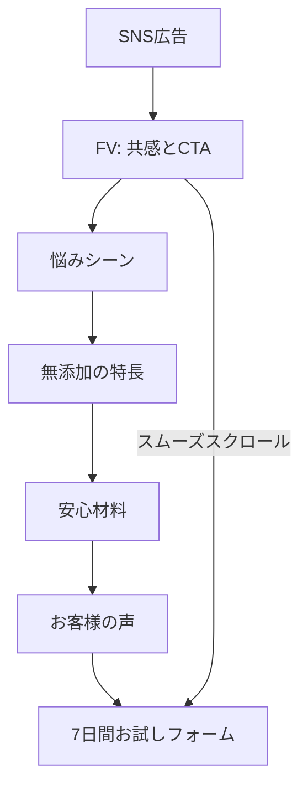

# 着色料無添加サプリ定期便 LP 要件定義書

対象プロダクト:着色料無添加サプリ定期便「澄み疲労ケア(仮)」ランディングページ

---

## 1. 概要

空のワークスペースに、`index.html` / `style.css` / `script.js` を新規作成する。フレームワークは使用せず、Vanilla HTML/CSS/JavaScriptで実装する。商品名・価格はダミー設定で進める。

## 2. ダミー設定(コピーの軸)

| 項目 | 内容 |
|---|---|
| ブランド名 | 着色料無添加サプリ定期便 |
| 商品名 | 澄み疲労ケア(仮) |
| オファー | まずは7日間お試し 980円(税込)。2回目以降は定期便。「いつでも解約可」という一文でハードルを下げる |
| 想定流入 | SNS広告経由の受動的な読者。ファーストビューで「自分ごと化」させ、スクロール後に無添加の安心へ接続する |

## 3. セクション構成

各セクション先頭に、意図を日本語コメントで残す(HTMLは`<!-- -->`、CSSは対応するブロックコメント)。

### セクション1:ファーストビュー(共感 + CTA)

**意図**:疲れという最重要の悩みで訪問者の手を止め、下までスクロールしなくても行動できる導線を置く。

- キャッチ例:「毎日忙しくて、疲れが取れない。そんなあなたへ」
- サブコピー:仕事も育児も、頑張っている人ほど後回しになりがちな「自分の回復」を、着色料無添加の定期便で支える、という一文
- 画像:プレースホルダー(placehold.jp)、または柔らかいグラデーションのヒーロー背景
- CTA:「まずは7日間お試し」→ `#cta` へスムーズスクロール
- 固定ヘッダーはシンプルに(ロゴ+CTA)。スマホではロゴ+小さめボタン

### セクション2:悩みの深掘り(生活シーン)

**意図**:30代・仕事と育児の両立を具体的に描写し、「うちのことだ」と感じさせる。

- 朝の寝不足、日中の会議と保育園のお迎え、夜に残るだるさ、という3つの生活シーン
- 「市販サプリのラベルを見て、着色料や添加物が気になった」という経験を短く挿入し、次セクション(無添加訴求)への橋渡しにする

### セクション3:商品紹介(着色料無添加が軸)

**意図**:共感のあとに「なぜこの商品か」を、無添加を主軸にした3つの特長で示す。

1. 着色料無添加(見た目より中身を重視)
2. 続けやすい1日1粒設計(忙しい人向け、ダミー)
3. 定期便だから買い忘れない

商品ビジュアルは placehold.jp によるボトル風プレースホルダーを使用する。

### セクション4:安心材料(透明性・証明)

**意図**:添加物への不安を持つ層に、感情面だけでなく「根拠」を提示する。

- 全成分をわかりやすく表示したダミー成分リスト
- 着色料無添加であることの説明(何を入れて、何を入れていないか)
- 第三者機関による残留検査・品質チェックのダミーバッジ/カード(検査機関名・ロット検査は架空だと分かる表記にする)

### セクション5:お客様の声(30代・3件)

**意図**:同世代の体験談による追体験で、「自分にも起こりそう」と感じさせる。実在を装いすぎないダミー表記にする。

| 属性 | 声の内容 |
|---|---|
| 32歳・事務職・子ども1人 | 夕方のだるさが和らいだ |
| 35歳・販売・子ども2人 | 成分表示がはっきりして飲み始めた |
| 29歳・在宅ワーク・育児中 | お試しから定期便に切り替えた |

顔写真はプレースホルダーの円形画像を使用する。

### セクション6:CTA(低ハードルオファー)

**意図**:本購入ではなく「7日間・980円」という小さな一歩で、意思決定のハードルを下げる。

- オファーの再掲、解約のしやすさ、定期便の流れを3ステップで提示
- 簡易フォーム(お名前・メールアドレス・同意チェック)+ 申込ボタン
- JS:バリデーション後にサンクス表示へ切り替える(送信先サーバーはなし。ポートフォリオ用のダミー実装)

## 4. 共通UI要件

| 項目 | 内容 |
|---|---|
| フッター | 特定商取引法・プライバシーポリシーのダミーリンク(`#`、またはページ内モーダルで短文表示)。効果効能を断定しない注意書きを明記する |
| レスポンシブ | スマホファースト(ベース幅375px想定)。余白・文字サイズ・ボタン高さ(44px以上)を確保し、PCでは`max-width`で中央カラムに収める |
| トーン | くすみグリーン+オフホワイト+暖かみのあるテキスト色。健康・安心を軸とし、派手な赤や煽り系の売り込み表現は避ける |

## 5. 技術実装

### 5-1. 画面遷移・情報設計

### 5-2. 実装方針

| レイヤー | 方針 |
|---|---|
| HTML | セマンティックな`header` / `main` / `section` / `footer`構造。各セクションに`id`を付与し、アンカーリンクの起点にする |
| CSS | モバイルファーストのブレークポイント(例:768px)。スティッキーヘッダー、カードグリッドはスマホ1列→PC2〜3列に切り替える |
| JavaScript | スムーズスクロール、フォームバリデーション、サンクス表示への切り替え。必要に応じて追従CTA(ファーストビューを過ぎたら画面下端に表示)の制御を行う |

## 6. 表現上の注意事項

薬機法に抵触しない表現にする。「治る」「必ず疲れが取れる」といった断定表現は使用せず、生活の変化・飲みやすさ・安心感の範囲に留めた表現とする。

## 7. 検証項目

- スマホ幅(約375px)とデスクトップ幅の両方で表示崩れがないか
- ファーストビューのCTAから、フォームまでスムーズにスクロール到達できるか
- フォームのエラー表示・送信成功時のサンクス表示が正しく切り替わるか
- セクションの順序と可読性(意図した訴求の流れになっているか)
